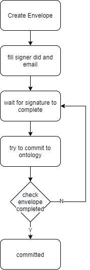

# OntSign JAVA SDK

OntSign is the integration of multiple e-signature service and [Ontology blockchain](https://ont.io).

## What Is E-Signature

An electronic signature is a digital mark indicating agreement to a contract or document.
For example, when you sign your name on a courier's mobile device — that's an electronic signature.

## Supported E-Signature Software

- [Docusign](https://www.docusign.com/)

- [HelloSign](https://www.hellosign.com/)
 
- [AdobeSign](https://acrobat.adobe.com/us/en/sign.html)

>Note: Adobe Sign has some little problem, it doesn't send email after invoke api, and cannot see corresponding log at adobe sign dashboard. 
 
- [OneSpanSign](https://www.onespan.com/products/esignature)

>Note: If signer email it the email of onespan sign account that you used api key of, the corresponding signature email wouldn't be send.

## OntSign Process

After invoke e-signature api, ontsign wait for signature completed. And then commit each file hash and signature id to
Ontology blockchain.

### Ontology Contract and E-Signature Service

We will combine [Ontology](https://ont.io) and docusign to further increase the credibility of signed contract.
We will record the hash of signed contract in Ontology chain because of the unforgeable feature of blockchain.

We provide a [contract](contracts/envelope.py) to record file hash, envelope ID, all signers and contract initiator.

The [api document](API.md) made a description about how to interact with Ontology blockchain.

And there are some test case that can be used to demonstrate how to use ontsign.